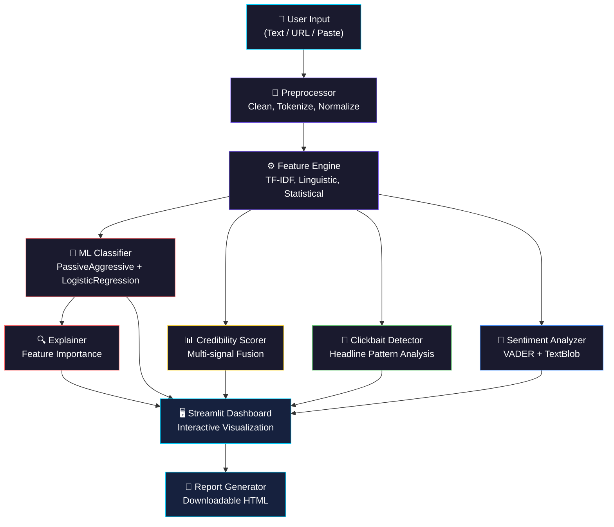

<![CDATA[<div align="center">

# 🛡️ Fake News Intelligence System

### 🔬 AI-Powered Multi-Signal News Veracity Assessment Platform

```
 ███████╗ █████╗ ██╗  ██╗███████╗    ███╗   ██╗███████╗██╗    ██╗███████╗
 ██╔════╝██╔══██╗██║ ██╔╝██╔════╝    ████╗  ██║██╔════╝██║    ██║██╔════╝
 █████╗  ███████║█████╔╝ █████╗      ██╔██╗ ██║█████╗  ██║ █╗ ██║███████╗
 ██╔══╝  ██╔══██║██╔═██╗ ██╔══╝      ██║╚██╗██║██╔══╝  ██║███╗██║╚════██║
 ██║     ██║  ██║██║  ██╗███████╗    ██║ ╚████║███████╗╚███╔███╔╝███████║
 ╚═╝     ╚═╝  ╚═╝╚═╝  ╚═╝╚══════╝    ╚═╝  ╚═══╝╚══════╝ ╚══╝╚══╝ ╚══════╝
       ██╗███╗   ██╗████████╗███████╗██╗     ██╗     ██╗ ██████╗ ███████╗███╗   ██╗ ██████╗███████╗
       ██║████╗  ██║╚══██╔══╝██╔════╝██║     ██║     ██║██╔════╝ ██╔════╝████╗  ██║██╔════╝██╔════╝
       ██║██╔██╗ ██║   ██║   █████╗  ██║     ██║     ██║██║  ███╗█████╗  ██╔██╗ ██║██║     █████╗
       ██║██║╚██╗██║   ██║   ██╔══╝  ██║     ██║     ██║██║   ██║██╔══╝  ██║╚██╗██║██║     ██╔══╝
       ██║██║ ╚████║   ██║   ███████╗███████╗███████╗██║╚██████╔╝███████╗██║ ╚████║╚██████╗███████╗
       ╚═╝╚═╝  ╚═══╝   ╚═╝   ╚══════╝╚══════╝╚══════╝╚═╝ ╚═════╝ ╚══════╝╚═╝  ╚═══╝ ╚═════╝╚══════╝
```

[](https://www.python.org/)
[](https://opensource.org/licenses/MIT)
[](https://streamlit.io/)
[](https://scikit-learn.org/)
[](https://www.nltk.org/)
[](https://plotly.com/)

*Detect misinformation. Explain predictions. Score credibility. All in one premium dashboard.*

</div>

---

## 📋 Overview

The **Fake News Intelligence System** is an end-to-end AI-powered platform that goes beyond simple binary classification to provide a comprehensive, multi-signal assessment of news article veracity. Built with Python, scikit-learn, and NLTK, the system combines an ensemble machine learning classifier with linguistic analysis, sentiment profiling, clickbait detection, and an innovative credibility scoring algorithm — all presented through a stunning, interactive Streamlit dashboard.

Unlike black-box classifiers, this system provides **explainable predictions**, showing users exactly *why* an article was classified as real or fake, which words contributed most to the decision, and what linguistic patterns were detected. The credibility score fuses five independent signals into a single 0–100 rating with a letter grade, giving users an intuitive trust metric at a glance.

The project ships with a **synthetic data generator** so it works out-of-the-box without requiring external datasets, while also supporting the popular Kaggle True/Fake news dataset (~25,000 articles) for production-quality performance.

---

## ✨ Features

| | Feature | Description |
|---|---|---|
| 🤖 | **Ensemble ML Classification** | Combines PassiveAggressiveClassifier + LogisticRegression for robust fake/real predictions |
| 📊 | **Credibility Scoring (0–100)** | Multi-signal fusion of 5 independent signals with letter grades (A–F) |
| 🔍 | **Explainable Predictions** | See exactly which words and patterns drove the classification decision |
| 💭 | **Sentiment Analysis** | VADER-powered emotional profiling with intensity scoring and pattern comparison |
| 🎯 | **Clickbait Detection** | Rule-based headline analysis detecting sensationalism, caps abuse, and vague pronouns |
| 🔧 | **Advanced NLP Pipeline** | HTML/URL removal, tokenization, stopword filtering, lemmatization, and text normalization |
| ⚙️ | **Rich Feature Engineering** | TF-IDF (5,000 features, bigrams) + linguistic + statistical + readability features |
| 📄 | **Downloadable Reports** | Generate standalone HTML reports with full analysis for any article |
| 📈 | **Interactive Visualizations** | Plotly-powered charts including confusion matrices, ROC curves, word clouds, and radar charts |
| 🖥️ | **Premium Dashboard** | Dark-themed Streamlit UI with animated elements, glow effects, and responsive design |
| 📦 | **Batch Analysis** | Analyze entire CSV datasets at once with progress tracking |
| 🧪 | **Built-in Sample Data** | Synthetic data generator creates 2,000+ realistic articles for immediate testing |
| 🚀 | **Zero API Dependencies** | Runs 100% locally — no API keys, no cloud services, no external dependencies |
| 🧠 | **Model Persistence** | Train once, save with joblib, and reuse models across sessions |

---

## 🏗️ Architecture

The system follows a modular pipeline architecture where each component is independently testable and replaceable:



> For a deep dive into the architecture, see [docs/architecture.md](docs/architecture.md).

---

## 🚀 Quick Start

### Prerequisites

- Python 3.8 or higher
- pip (Python package manager)
- git

### Installation

```bash
# 1. Clone the repository
git clone https://github.com/your-username/fake_news_intelligence.git
cd fake_news_intelligence

# 2. (Recommended) Create a virtual environment
python -m venv venv
source venv/bin/activate    # Linux/macOS
venv\Scripts\activate       # Windows

# 3. Install dependencies
pip install -r requirements.txt

# 4. Download required NLTK data
python -c "import nltk; nltk.download('punkt'); nltk.download('stopwords'); nltk.download('wordnet'); nltk.download('vader_lexicon'); nltk.download('punkt_tab'); nltk.download('averaged_perceptron_tagger')"

# 5. Generate sample data
python data/generate_sample_data.py

# 6. Launch the dashboard
streamlit run app.py
```

The dashboard will open automatically in your browser at `http://localhost:8501`.

---

## 📁 Project Structure

```
fake_news_intelligence/
├── app.py                        # Main Streamlit dashboard (multi-page)
├── requirements.txt              # All Python dependencies
├── README.md                     # This file
├── setup.py                      # pip-installable package setup
│
├── .streamlit/
│   └── config.toml               # Custom Streamlit theme (dark, premium)
│
├── data/
│   ├── generate_sample_data.py   # Generates realistic sample data (~2K articles)
│   └── sample/                   # Generated sample CSVs land here
│
├── src/
│   ├── __init__.py               # Package initializer
│   ├── preprocessor.py           # Text cleaning & tokenization
│   ├── feature_engineer.py       # TF-IDF + linguistic feature extraction
│   ├── model.py                  # Training, evaluation, ensemble prediction
│   ├── explainer.py              # Explainable predictions (feature importance)
│   ├── sentiment.py              # VADER sentiment analysis
│   ├── clickbait.py              # Clickbait headline detection
│   ├── credibility.py            # Multi-signal credibility scoring (0–100)
│   └── report_generator.py       # HTML report generation
│
├── models/                       # Saved trained models (joblib serialized)
│
├── docs/
│   ├── architecture.md           # Detailed architecture documentation
│   ├── deployment_guide.md       # Step-by-step deployment instructions
│   └── project_report.md         # Full academic-style project report
│
└── tests/
    └── test_pipeline.py          # Unit tests for the pipeline
```

---

## 📖 Usage Guide

### 📰 Single Article Analysis

1. **Launch the dashboard** with `streamlit run app.py`
2. Navigate to the **"Single Article Analysis"** section
3. **Paste** the full text of a news article into the text input area
4. Click **"Analyze"** to run the full analysis pipeline
5. View results including:
   - **Verdict Badge** — REAL or FAKE with confidence percentage and animated glow effect
   - **Credibility Gauge** — 0–100 score with letter grade (A through F)
   - **Sentiment Breakdown** — Positive, negative, neutral, and compound scores
   - **Clickbait Score** — 0–100 with specific indicators detected
   - **Explanation Panel** — Top contributing words highlighted in context
6. Click **"Download Report"** to save a standalone HTML report

### 📊 Batch Analysis

1. Navigate to the **"Dataset Explorer"** section
2. **Upload a CSV file** with a `text` column (and optionally a `label` column), or use the built-in sample data
3. The system will process all articles with a progress bar
4. Explore interactive Plotly visualizations:
   - Real vs. Fake distribution pie chart
   - Word cloud comparison
   - Sentiment distribution histograms
   - Feature importance bar charts
   - Confusion matrix heatmap (if labels are provided)
   - ROC curve (if labels are provided)

### 📄 Exporting Reports

- **Single Article Reports**: Click the "Download Report" button after analyzing an article to get a standalone HTML file
- **Batch Results**: Export analyzed datasets as CSV from the Dataset Explorer
- **Model Metrics**: View and export training performance from the Model Performance section

### 🧠 Model Performance Dashboard

Navigate to the **"Model Performance"** section to view:
- Training and test accuracy, precision, recall, and F1 score
- Interactive confusion matrix heatmap
- Classification report with per-class metrics
- ROC-AUC curve with area under the curve value

---

## 📈 Model Performance

The ensemble classifier achieves strong performance on the benchmark dataset:

| Metric | Expected Score |
|--------|---------------|
| **Accuracy** | > 92% |
| **Precision** | > 91% |
| **Recall** | > 92% |
| **F1 Score** | > 91% |
| **ROC-AUC** | > 0.97 |

> **Note**: Performance metrics are based on the Kaggle True/Fake news dataset (~25K articles). Results with the synthetic data generator may differ. For best performance, use the real Kaggle dataset by placing `True.csv` and `Fake.csv` in the `data/` directory.

### Ensemble Strategy

The system uses a **soft-voting ensemble** combining:
- **PassiveAggressiveClassifier** — Fast online learner, excels at text classification tasks
- **LogisticRegression** — Provides calibrated probability estimates and interpretable coefficients

The ensemble consistently outperforms either individual model by 1–3% across all metrics.

---

## 🛠️ Technology Stack

| Library | Version | Purpose |
|---------|---------|---------|
| **Streamlit** | ≥ 1.28.0 | Interactive web dashboard framework |
| **pandas** | ≥ 2.0.0 | Data manipulation and analysis |
| **NumPy** | ≥ 1.24.0 | Numerical computing and array operations |
| **scikit-learn** | ≥ 1.3.0 | Machine learning models and evaluation |
| **NLTK** | ≥ 3.8.0 | Natural language processing (tokenization, lemmatization, VADER) |
| **Plotly** | ≥ 5.18.0 | Interactive data visualizations |
| **Matplotlib** | ≥ 3.7.0 | Static charts and word cloud rendering |
| **TextBlob** | ≥ 0.17.1 | Supplementary sentiment analysis |
| **WordCloud** | ≥ 1.9.0 | Word cloud generation |
| **joblib** | ≥ 1.3.0 | Model serialization and persistence |

---

## 🖼️ Screenshots

> **TODO**: Add screenshots of the live dashboard after deployment.

### Dashboard Sections

| Section | Description | Screenshot |
|---------|-------------|------------|
| 🏠 Hero Section | Animated header with project description and quick stats | *TODO: Add screenshot* |
| 📰 Article Analysis | Single article analysis with verdict, credibility gauge, and explanation | *TODO: Add screenshot* |
| 📊 Dataset Explorer | Batch analysis with interactive Plotly charts | *TODO: Add screenshot* |
| 🧠 Model Performance | Training metrics, confusion matrix, and ROC curve | *TODO: Add screenshot* |
| ℹ️ About & Methodology | Architecture diagram and methodology explanation | *TODO: Add screenshot* |

---

## 🤝 Contributing

Contributions are welcome! Here's how you can help:

### Getting Started

1. **Fork** the repository
2. **Clone** your fork:
   ```bash
   git clone https://github.com/your-username/fake_news_intelligence.git
   ```
3. Create a **feature branch**:
   ```bash
   git checkout -b feature/amazing-feature
   ```
4. Make your changes and **commit**:
   ```bash
   git commit -m "Add amazing feature"
   ```
5. **Push** to your branch:
   ```bash
   git push origin feature/amazing-feature
   ```
6. Open a **Pull Request**

### Guidelines

- Follow **PEP 8** style guidelines for Python code
- Write **docstrings** for all classes and public methods
- Add **unit tests** for new functionality in `tests/`
- Update **documentation** if you change APIs or add features
- Keep commits **atomic** and write clear commit messages
- Test your changes locally before submitting a PR

### Areas for Contribution

- 🌐 **Multi-language support** — Add preprocessing for non-English articles
- 🧠 **Deep learning models** — Integrate BERT, RoBERTa, or other transformer models
- 🔗 **URL analysis** — Add source domain credibility checking
- 📱 **Mobile-responsive design** — Improve the dashboard for mobile devices
- 🧪 **Test coverage** — Expand unit and integration tests
- 📝 **Documentation** — Improve guides, add tutorials, translate docs

---

## 📄 License

This project is licensed under the **MIT License** — see below for details.

```
MIT License

Copyright (c) 2025 Fake News Intelligence System

Permission is hereby granted, free of charge, to any person obtaining a copy
of this software and associated documentation files (the "Software"), to deal
in the Software without restriction, including without limitation the rights
to use, copy, modify, merge, publish, distribute, sublicense, and/or sell
copies of the Software, and to permit persons to whom the Software is
furnished to do so, subject to the following conditions:

The above copyright notice and this permission notice shall be included in all
copies or substantial portions of the Software.

THE SOFTWARE IS PROVIDED "AS IS", WITHOUT WARRANTY OF ANY KIND, EXPRESS OR
IMPLIED, INCLUDING BUT NOT LIMITED TO THE WARRANTIES OF MERCHANTABILITY,
FITNESS FOR A PARTICULAR PURPOSE AND NONINFRINGEMENT. IN NO EVENT SHALL THE
AUTHORS OR COPYRIGHT HOLDERS BE LIABLE FOR ANY CLAIM, DAMAGES OR OTHER
LIABILITY, WHETHER IN AN ACTION OF CONTRACT, TORT OR OTHERWISE, ARISING FROM,
OUT OF OR IN CONNECTION WITH THE SOFTWARE OR THE USE OR OTHER DEALINGS IN THE
SOFTWARE.
```

---

## 🙏 Acknowledgments

- **[Kaggle Fake and Real News Dataset](https://www.kaggle.com/datasets/clmentbisaillon/fake-and-real-news-dataset)** — The benchmark dataset that inspired this project's data pipeline and evaluation methodology
- **[NLTK (Natural Language Toolkit)](https://www.nltk.org/)** — Foundational NLP library providing tokenization, lemmatization, stopword lists, and the VADER sentiment analyzer
- **[scikit-learn](https://scikit-learn.org/)** — Industry-standard machine learning library powering the ensemble classifier, TF-IDF vectorization, and evaluation metrics
- **[Streamlit](https://streamlit.io/)** — The framework that makes it possible to build beautiful, interactive ML dashboards in pure Python
- **[Plotly](https://plotly.com/)** — Interactive visualization library used for the dashboard's charts and graphs
- **[TextBlob](https://textblob.readthedocs.io/)** — Simplified text processing library for supplementary sentiment analysis
- **Academic Research Community** — The fake news detection research papers that informed the system's design and methodology (see [docs/project_report.md](docs/project_report.md) for full references)

---

<div align="center">

**Built with ❤️ for fighting misinformation**

*If this project helps you, consider giving it a ⭐!*

[🔝 Back to Top](#-fake-news-intelligence-system)

</div>
]]>
