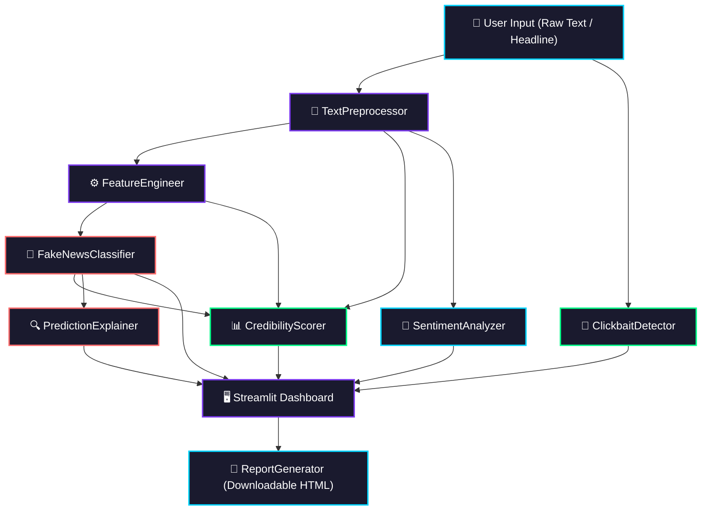

# Fake News Intelligence System — Architecture Documentation

This document provides a detailed technical overview of the architecture, components, and data flow of the **Fake News Intelligence System**.

---

## 1. System Architecture

The Fake News Intelligence System is structured as a modular processing pipeline. Each phase of analysis is decoupled, allowing components to be developed, tested, and scaled independently.



---

## 2. Component Descriptions

### 2.1. TextPreprocessor (`src/preprocessor.py`)
- **Purpose**: Cleans raw, noisy text inputs and standardizes token representations to optimize feature extraction.
- **Key Methods**:
  - `clean_text(text: str) -> str`: Normalizes whitespace, strips HTML tags, removes URLs, filters emails, and converts alphanumeric characters to lowercase.
  - `tokenize(text: str) -> list[str]`: Segments the string into discrete tokens (words) utilizing NLTK's sentence/word tokenizers.
  - `remove_stopwords(tokens: list[str]) -> list[str]`: Filters out common English words (such as "the", "is", "at") that contain minimal semantic content.
  - `lemmatize(tokens: list[str]) -> list[str]`: Normalizes words to their base or dictionary form (lemmas) using WordNet.
  - `preprocess(text: str) -> str`: Orchestrates the full cleaning pipeline, returning a single normalized string ready for vectorization.

### 2.2. FeatureEngineer (`src/feature_engineer.py`)
- **Purpose**: Combines statistical bag-of-words representations (TF-IDF) with stylistic/linguistic indicators designed to capture differences between objective journalism and sensationalism.
- **Key Methods**:
  - `get_linguistic_features(text: str) -> dict[str, float]`: Computes dense metadata features:
    - *Word & Sentence Statistics*: Word count, sentence count, average word length, average sentence length.
    - *Stylistic Indicators*: Caps ratio (all-caps letters), exclamation mark count, question mark count, quotation mark count (indicates quotes/attribution), unique word ratio.
    - *Readability Score*: Flesch-Kincaid readability ease approximation.
  - `fit(texts: list[str])` / `transform(texts: list[str])`: Fits the sparse TF-IDF vectorizer (5000 max features, bigrams) and horizontally stacks it with the dense linguistic features using `scipy.sparse.hstack`.

### 2.3. FakeNewsClassifier (`src/model.py`)
- **Purpose**: Uses an ensemble machine learning model to classify articles and output class probabilities.
- **Key Methods**:
  - `train(texts, labels)`: Splits the data, fits the feature engineering pipeline, trains two models (PassiveAggressiveClassifier and LogisticRegression), and computes verification metrics (accuracy, precision, recall, F1, confusion matrix, ROC-AUC).
  - `predict(text)`: Transforms and preprocesses the text, extracts features, queries both models, and computes a confidence score. If they agree, the classification label is selected; if not, the LogisticRegression probability decides the label.

### 2.4. PredictionExplainer (`src/explainer.py`)
- **Purpose**: Provides transparency and explainability (XAI) for predictions by tracing model coefficients to specific vocabulary items in the text.
- **Key Methods**:
  - `explain(text: str) -> dict`: Inspects the logistic regression model coefficients, correlates them with features present in the input text, and returns the top 10 FAKE and REAL indicator words along with a formatted text explanation.

### 2.5. SentimentAnalyzer (`src/sentiment.py`)
- **Purpose**: Evaluates the emotional tone and intensity of the article. Fake news frequently utilizes highly negative, sensationalist, or polarizing language.
- **Key Methods**:
  - `analyze(text: str) -> dict`: Utilizes NLTK's VADER (Valence Aware Dictionary and sEntiment Reasoner) to compute positive, negative, neutral, and compound scores, and highlights extreme sentiment deviations.

### 2.6. ClickbaitDetector (`src/clickbait.py`)
- **Purpose**: Evaluates article titles for clickbait patterns.
- **Key Methods**:
  - `detect(headline: str) -> dict`: Matches patterns such as excessive capitalization, sensationalist vocabulary, lists starting with numbers ("X things you..."), superlatives, vague/curiosity-gap pronouns ("This is why..."), and emotional manipulation phrases.

### 2.7. CredibilityScorer (`src/credibility.py`)
- **Purpose**: Fuses multiple analytic signals into a single, intuitive trust index in the range 0-100, mapped to a letter grade (A-F).
- **Formula & Weights**:
  - **ML Model Confidence**: 40%
  - **Sentiment Extremity (Penalty)**: 15%
  - **Clickbait Presence (Penalty)**: 15%
  - **Linguistic Quality Heuristics**: 15% (penalizes excessive capitalization, extreme readability difficulties, or lack of sentence structure).
  - **Source Credibility Indicators**: 15% (rewards named entities, quoted attributions, and specific date/time markers).

### 2.8. ReportGenerator (`src/report_generator.py`)
- **Purpose**: Dynamically renders stand-alone, responsive, dark-themed HTML files summarizing all indicators and classification parameters.

---

## 3. Data Flow

```
[User inputs headline/body]
           ↓
    [Preprocessing]  ──(Raw title)──> [ClickbaitDetector] ──> Clickbait Score
           ↓
    [FeatureEngine] ──(Dense Stats)──> [SentimentAnalyzer] ──> Sentiment compounding
           ↓
   [TF-IDF & Stacked]
           ↓
   [Classifier & Ensemble] ──────────> Predict Label & Probability
           ↓
    [XAI Explainer] ─────────────────> Word Coefficient Map & Weights
           ↓
   [CredibilityScorer] <──(Fuses signals)
           ↓
 [Streamlit Dashboard / HTML Report]
```
